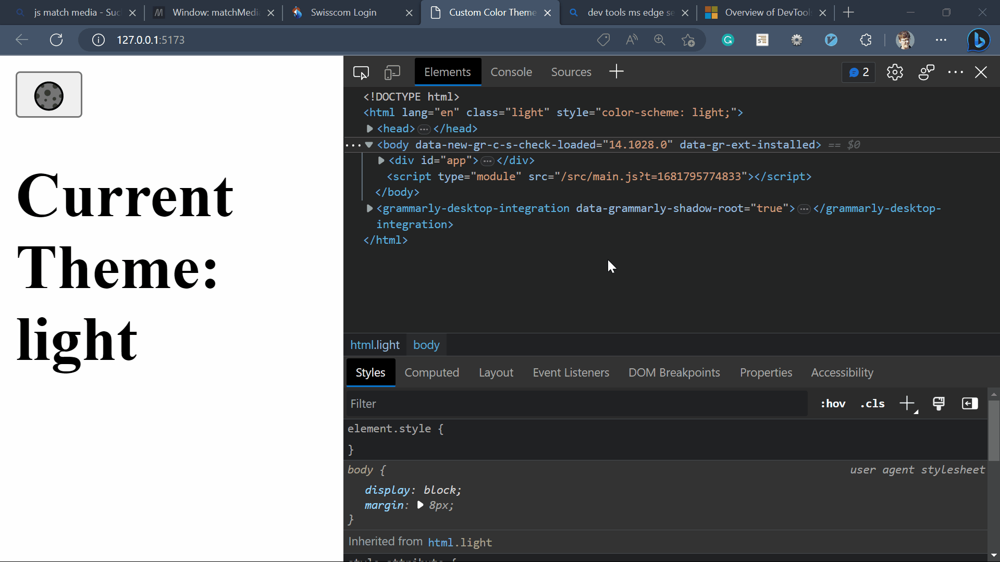
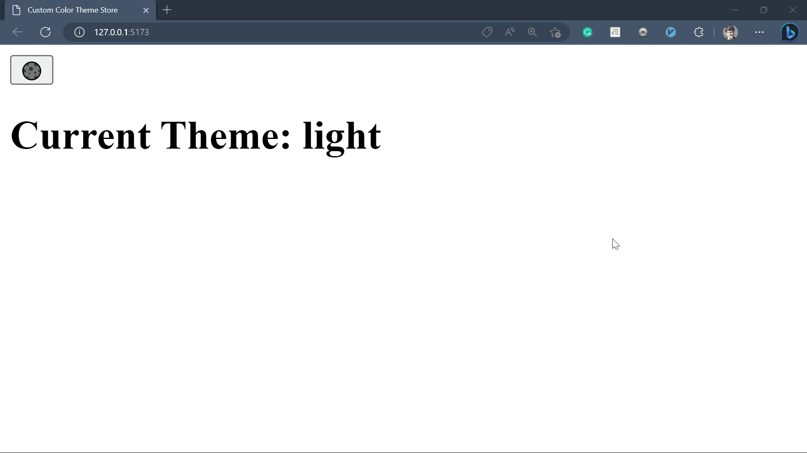

Welcome to this relatively short and simple tutorial on creating a [Custom Svelte Store](https://svelte.dev/tutorial/custom-stores) that manages the current color scheme.

We will make it so the default color scheme from the Operating System is used, and then the Preferences are stored in Local Storage.

It will also register theme changes in other tabs, windows, and iframes. To do this, we will learn about the [Broadcast API](https://developer.mozilla.org/en-US/docs/Web/API/Broadcast_Channel_API).

Lastly, we learn how to use our custom store in our application with Tailwindcss.


<!-- [ INTRODUCTION - Things we learn today ]

- [Custom Svelte Stores](https://svelte.dev/tutorial/custom-stores)
- [Svelte Reactive Declarations](https://svelte.dev/tutorial/reactive-declarations)
- [Tailwind Class Strategy](https://tailwindcss.com/docs/dark-mode#toggling-dark-mode-manually)
- [Window Match Media](https://developer.mozilla.org/en-US/docs/web/api/window/matchmedia)
- Clearing Local Storage -->

To start, we create a new [Vite](https://vitejs.dev/) project with the following command.

```bash
npm create vite@latest
```

You can now answer all the questions. Regarding the framework, you chose Svelte, and it does not matter if you only use Svelte or Svelte Kit because the feature we build here will work in both.

You can then run the project by typing `npm run dev`, assuming you are in your project folder where the package.json file lies.

## Creating a Custom Svelte Store

[ Video of Clearing local storage ]



## Using the Custom Svelte Store

### Handling Color Scheme in the styling

### Toggle Button



[ Conclusion ]
